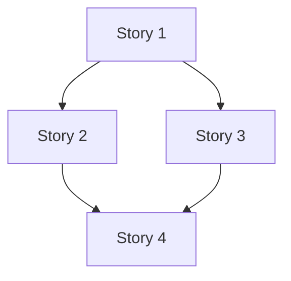
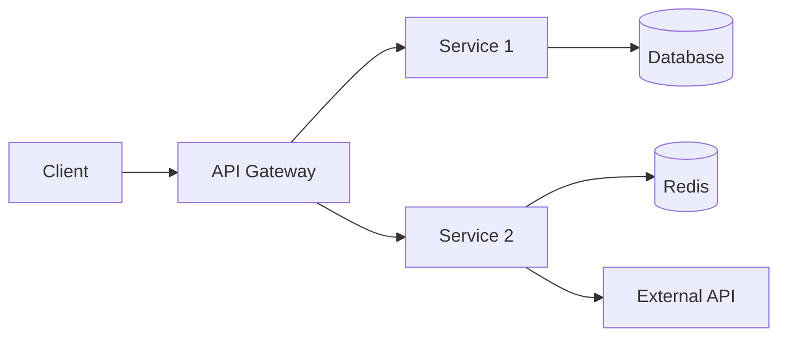

# Epic Analysis: [EPIC-KEY] - [Title]

## 📋 Epic Overview
- **Type**: Epic
- **Priority**: [Critical/High/Medium/Low]
- **Status**: Discovery
- **Owner**: [Product Owner]
- **Tech Lead**: [Developer]
- **Target Release**: [Version/Sprint]

## 🎯 Business Objectives
1. [Objective 1]
2. [Objective 2]
3. [Objective 3]

## 📊 Stories Breakdown

### Story List
| Story Key | Title | Priority | Complexity | Dependencies |
|-----------|-------|----------|------------|--------------|
| [KEY-1] | [Title] | P0 | Complex | None |
| [KEY-2] | [Title] | P1 | Standard | [KEY-1] |
| [KEY-3] | [Title] | P1 | Simple | [KEY-1] |
| [KEY-4] | [Title] | P2 | Standard | [KEY-2], [KEY-3] |

### Dependency Matrix


### Implementation Order
1. **Phase 1**: Foundation
   - [ ] [KEY-1]: Base infrastructure
   
2. **Phase 2**: Core Features
   - [ ] [KEY-2]: Feature A
   - [ ] [KEY-3]: Feature B
   
3. **Phase 3**: Integration
   - [ ] [KEY-4]: Complete integration

## 🏗️ Technical Architecture

### System Design


### Component Structure
```
app/
├── Services/
│   ├── [Feature]Service.php
│   └── [Integration]Service.php
├── Actions/
│   ├── [Create]Action.php
│   └── [Process]Action.php
├── Controllers/
│   └── [Feature]Controller.php
├── DTOs/
│   ├── [Request]DTO.php
│   └── [Response]DTO.php
└── Events/
    └── [Feature]Event.php
```

### Shared Components
- **Base Classes**:
  - Abstract[Feature]Service
  - [Feature]Interface
  
- **Utilities**:
  - [Feature]Helper
  - [Feature]Validator
  
- **Common DTOs**:
  - Base[Feature]DTO
  - [Feature]ResponseDTO

## 💾 Database Design

### New Tables
```sql
-- Table 1
CREATE TABLE feature_main (
    id BIGSERIAL PRIMARY KEY,
    -- fields
);

-- Table 2
CREATE TABLE feature_details (
    id BIGSERIAL PRIMARY KEY,
    main_id BIGINT REFERENCES feature_main(id),
    -- fields
);
```

### Migrations Required
1. Create main tables
2. Add indexes
3. Set up foreign keys
4. Seed initial data

## 🔌 API Specifications

### New Endpoints
```yaml
Resource: /api/v1/[feature]
Operations:
  - GET /api/v1/[feature] - List all
  - GET /api/v1/[feature]/{id} - Get single
  - POST /api/v1/[feature] - Create new
  - PUT /api/v1/[feature]/{id} - Update
  - DELETE /api/v1/[feature]/{id} - Delete
```

### Authentication & Authorization
- **Auth Type**: JWT Bearer
- **Permissions**:
  - View: [permission.view]
  - Create: [permission.create]
  - Update: [permission.update]
  - Delete: [permission.delete]

## ⚠️ Risks & Mitigation

### Technical Risks
| Risk | Probability | Impact | Mitigation |
|------|-------------|--------|------------|
| Performance degradation | Medium | High | Implement caching, optimize queries |
| External API downtime | Low | High | Fallback mechanism, retry logic |
| Data migration issues | Medium | Medium | Thorough testing, rollback plan |

### Business Risks
| Risk | Probability | Impact | Mitigation |
|------|-------------|--------|------------|
| Scope creep | High | Medium | Clear requirements, regular reviews |
| User adoption | Medium | High | Training, documentation |

## 🧪 Testing Strategy

### Test Coverage Goals
- **Unit Tests**: 90% coverage
- **Integration Tests**: Key flows covered
- **E2E Tests**: Critical paths tested
- **Performance Tests**: Load testing required

### Test Plan by Story
- **[KEY-1]**: Focus on infrastructure
- **[KEY-2]**: Business logic validation
- **[KEY-3]**: Integration points
- **[KEY-4]**: End-to-end scenarios

## 📈 Success Metrics

### Technical KPIs
- Response time < 200ms
- Error rate < 0.1%
- Test coverage > 85%
- Zero critical bugs

### Business KPIs
- [Metric 1]: Target value
- [Metric 2]: Target value
- [Metric 3]: Target value

## 🚀 Rollout Strategy

### Deployment Phases
1. **Dev Environment**: Complete testing
2. **Staging**: Integration testing
3. **Production**: Phased rollout
   - Phase 1: 10% users
   - Phase 2: 50% users
   - Phase 3: 100% users

### Feature Flags
```yaml
flags:
  - feature_enabled: false
  - feature_beta: true
  - feature_percentage: 10
```

### Rollback Plan
1. Disable feature flags
2. Revert deployment if needed
3. Database rollback scripts ready
4. Communication plan

## 📚 Documentation Requirements

### Technical Documentation
- [ ] Architecture diagrams
- [ ] API specifications
- [ ] Database schema
- [ ] Deployment guide

### User Documentation
- [ ] User guide
- [ ] Admin guide
- [ ] API documentation
- [ ] Migration guide

## 🗓️ Timeline Estimate

### Development Phases
| Phase | Stories | Estimated Duration |
|-------|---------|-------------------|
| Foundation | [KEY-1] | Sprint 1 |
| Core Development | [KEY-2], [KEY-3] | Sprint 2-3 |
| Integration | [KEY-4] | Sprint 4 |
| Testing & Documentation | All | Sprint 5 |

## 📝 Open Questions
1. [Question 1]
2. [Question 2]
3. [Question 3]

## 🔗 References
- Business Requirements: [Link]
- Technical Specifications: [Link]
- Design Mockups: [Link]
- Related Epics: [Links]

## ✅ Sign-offs Required
- [ ] Product Owner
- [ ] Tech Lead
- [ ] Architecture Team
- [ ] Security Team
- [ ] DevOps Team

---
*Epic analysis completed on: [Date]*
*Analyst: [Name]*
*Next Review: [Date]*